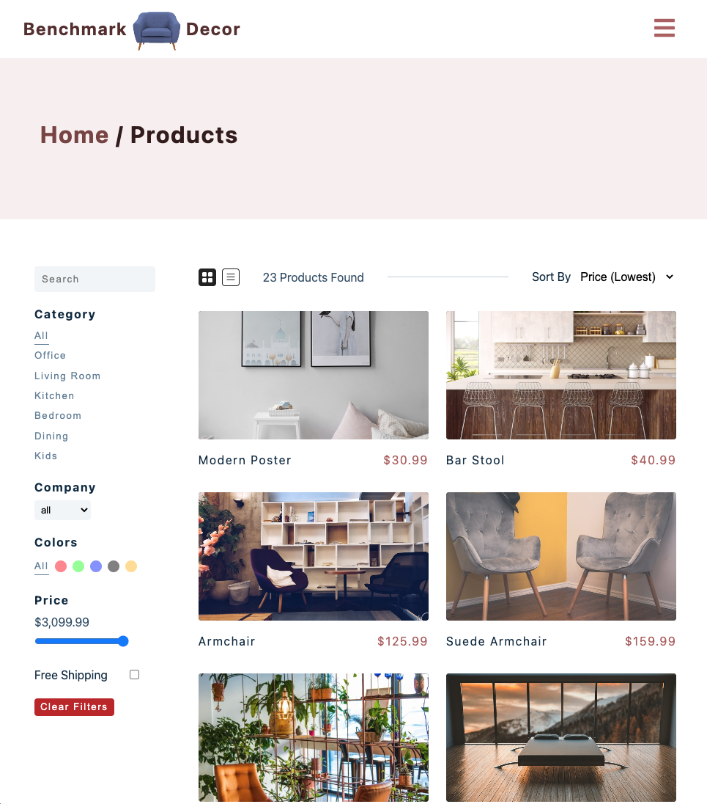

# Benchmark Decor

Welcome to Benchmark Decor, an e-commerce website for a furniture store. This website allows you to find what your looking for easily with many helpful filters. Build a cart with our wonderful products, login to your account using a Google account or your own email/password, and checkout your cart securely using Stripe.



Above: *Products Page*

## Getting Started

If you are interested in further developing this project, please follow the steps below.

* After downloading the project from GitHub, run `npm install` in the terminal of the root directory to install dependencies.
* Create a `.env` file in the root directory.
* Login or register to Stripe and create an account for this project.
  * <https://stripe.com/>
  * Add a `REACT_APP_STRIPE_PUBLIC_KEY` and `REACT_APP_STRIPE_SECRET_KEY` property to the `.env` file and set it to your Stripe public and secret keys.
* Login or register to Auth0 and create a new application for this project.
  * <https://auth0.com/>
  * Add a `REACT_APP_AUTH0_DOMAIN` and `REACT_APP_AUTH0_CLIENT_ID` property to the `.env` file and set it to your Auth0 domain and client ID values.
* Install netlify-cli either globally or locally.
  * Globally- Run the following command in your terminal:
  ```
  npm install netlify-cli -g
  ```

  * Locally- Run the following command in your terminal:

  ```
  npm install --save-dev netlify-cli
  ```
* Add <http://localhost:8888> to your Auth0 application under `Allowed Callback URLs`, `Allowed Logout URLs`, and `Allowed Web Origins`.

## Running the Project

* Run `netfliy dev` in the terminal in the root directory of your project.
* Access the website at [localhost:8888](http://localhost:8888)
